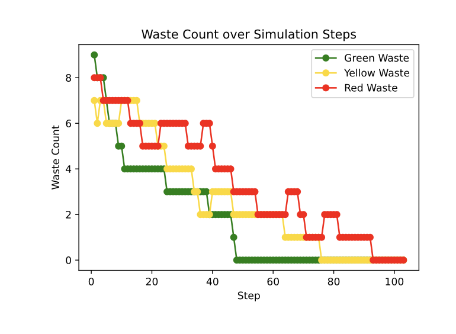

# SMA-cs-2025-robots
A repository to build the self-organization of robots in a hostile environment (see Problem Overview section for environment rules). To run the code, please look at the last section.

<div align="center">
  
</div>

# Our Approach

The ambition of this project being quite daunting, we decided to take the project step by step.
- Firstly, we interacted with the mesa and solara library to plot a single graph and wastes randomly, as well as the rules. At this point, the agent did not interact with each other. This was step 1.
- Step 2, we implemented agents that move randomly, collect wastes and transform them once they have gathered two of them. Red ones then put them on the disposal zone, getting rid of them altogether. 
- Step 3 consisted in implementing agents that can communicate with each other (for instance tell the nearest yellow agent that they transformed a yellow waste on their feet so that the yellow agent can collect it, etc...)
- Step 4 consisted in fine-tuning the heuristics and communication rules to leverage multi-agent strength (inspired by ants' pheromone as the teachers said) for the best performance possible.
- Step 5 was not implemented due to time constraints but the goal was to compare the zone limitations of yellow and red agents for better path optimization (detailed in choice section)

## Our solution


We implemented four main blocs:
<strong>
- Initialization parameters
- Simulation buttons (play, step, count)
- Simulation environment grid
- Waste History Graph
</strong>

Each are detailed on the image and allow us to use the algorithm as per our liking (whether it be the size of the grid, the number of agents or more). 
For better UX, we limited the range of the initialization parameter for best performance, otherwise the run can become quite long as they would interact with each other. Even though the **inference time** was not one of our metric, we still hoped to offer best experience to the user through this limitation.

## Choices & constraints

Step 1 and 2 were pretty standard as per the project's transcript.

However, starting from step 3, we had to make some choices. At first, we thought about using complex algorithms such as shortest path algorithm, but then we thought that it would not match the course's goal of making agents communicate. As such, we **added** a constraint limiting the vision of agents to their current position (as in they can't know where the closest waste of their colour is unless they step on it). Although this added complexity to the algorithm, it also made the communicate much more relevant in the project.

After several tries, we also realized that limiting the communication to waste location was the right thing to do as otherwise, the simulations become slow and much less evaluating them properly, just running them once took quite a long time.

In terms of heuristic choices, in step 2, 3 and 4, we decided to allow the yellow (resp. red) agents to freely move in green (resp. green and yellow) zones so that they could cover a bigger area and communicate with the green agents. We planned to compare this feature in step 5, but lacked time to implement it. As we are writing this, we do realize that maybe it would have been more efficient to just leave them to their zone and restrict them as the longest part of the simulation is left to the exploration and finding of the last wastes.

In step 4, we fixed a couple of id bugs that made our simulations slower and implemented a memory preventing the agents from exploring the same square twice. In other words, inspiring ourselves from ants' collective intelligence and pheromones, their actions allow to generate a collective map that they update with each square they explore (0 for empty squares, 1 for green waste, 2 for yellow waste, 3 for red waste, -1 for unexplored). This was a feature that was especially tough to implement as we realized the agents were sometimes stuck or took unoptimized paths. However, we persevered and added heuristic strategy (S-shape trajectory, shortest agent communication for waste collection etc...) allowing for best performance.

<div align="center">
  
</div>

To evaluate the algorithms, we ran between 2 and 5 simulations to limit variance.

Lastly, starting from step 3, we implemented a rule allowing agents to not drop the waste on their feet, but instead drop it in waste collection zones, allowing for better communication between agents.


## Criteria for success
Because our approach has a random component (stochastic nature of the agents movement), in all steps including the fine-tuned one, we decided that we would evaluate our algorithm using a custom feature: **the number of steps before 90% of the wastes are collected**. After all, finding the last waste could be done in a couple of steps, or, in the worst case, in hundreds.

<div align="center">
  
</div>

## Results
| Step number | Description                                                                                                                                                   | Steps to reach 90% waste disposal                                                              | Image (line plot)              |
|-------------|---------------------------------------------------------------------------------------------------------------------------------------------------------------|------------------------------------------------------------------------------------------------|-------------------------------|
| 1           | Interacted with Mesa and Solara to plot a single graph and randomly generate wastes and rules. No agent interaction yet.                                     | ∠steps          |     |
| 2           | Implemented agents that move randomly, collect wastes, and transform them. Red agents dispose of waste in disposal zones.                                     | ~330 steps                |     |
| 3           | Enabled communication between agents (limited to communicating position of transformed waste to the nearest agent of corresponding colours)                     | ~230 steps       |     |
| 4           | Fine-tuned heuristic strategy and communication using multi-agent optimization strategies (Collective exploration map inspired by ants)                                 | ~100 steps              |     |
| 5           | Not implemented due to time constraints                                                                                | ? steps                 |     |


# Problem Overview and Constraints
In all honesty, the below section was generated with chatgpt to reflect our understanding of the project.

## 🌍 Problem Overview  
The objective is to model and simulate a **multi-agent system** of robots 🤖 that **collect**, **transform**, and **transport hazardous waste** ☢️ in a hostile environment. The environment consists of different **radioactive zones**, and the robots must work within their capabilities to efficiently manage waste disposal.  
The mission involves:  
- 🧹 **Collecting** waste from designated areas.  
- 🔄 **Transforming** waste from one type to another.  
- 🚛 **Transporting** transformed waste to a secure disposal area.  
- 🧭 **Navigating** the environment while adhering to movement restrictions imposed by radioactivity levels.

---

## ⚠️ Environmental Constraints  
The environment is divided into **three distinct zones**, each with increasing levels of radioactivity:

1. 🟢 **Zone 1 (Low Radioactivity)**: Contains randomly placed **green waste** ♻️.  
2. 🟡 **Zone 2 (Medium Radioactivity)**: Intermediate area for **waste transformation**.  
3. 🔴 **Zone 3 (High Radioactivity)**: Final destination where **transformed red waste** must be stored securely.

### 🗑️ Waste Types:
- ♻️ **Green Waste**: Initial waste collected from Zone 1.  
- 💛 **Yellow Waste**: Transformed from green waste.  
- ❤️ **Red Waste**: Transformed from yellow waste and stored in Zone 3.

---

## 🤖 Robot Constraints  

### 🟢 Green Robot:
- 🧭 Moves within **Zone 1 only**.  
- ♻️ Collects **2 green wastes** → 🔄 Transforms into **1 yellow waste**.  
- 🚚 Transports **1 yellow waste** eastward ➡️.

### 💛 Yellow Robot:
- 🧭 Moves within **Zones 1 and 2**.  
- 💛 Collects **2 yellow wastes** → 🔄 Transforms into **1 red waste**.  
- 🚚 Transports **1 red waste** eastward ➡️.

### 🔴 Red Robot:
- 🧭 Moves within **Zones 1, 2, and 3**.  
- ❤️ Collects **1 red waste** → 🚛 Transports it to the **waste disposal zone** in Zone 3.

---

# How to run the code

## 📦 Installation

To run the code, make sure you have Python installed (we use 3.11). Then install the required libraries:

```bash
pip install mesa solara matplotlib plotly
```

---

## 🚀 Running the Application

Navigate to the project directory and run the Solara app:

```bash
cd ./step_4
solara run run.py
```

This will start a web-based GUI for interacting with the simulation.

## 🛠️ Project Structure

- `agents.py` – Defines the robot agents and their behaviors.
- `model.py` – Sets up the Mesa model and simulation logic.
- `objects.py` – Contains environmental agents like Waste and Disposal Zones.
- `schedule.py` – Custom scheduler for agent activation.
- `run.py` – Frontend powered by Solara for visualization and control.


## 👥 Authors

- Louis LHOTTE  
- Ambroise MARTIN-ROUVILLE  
- Edouard SEGUIER


