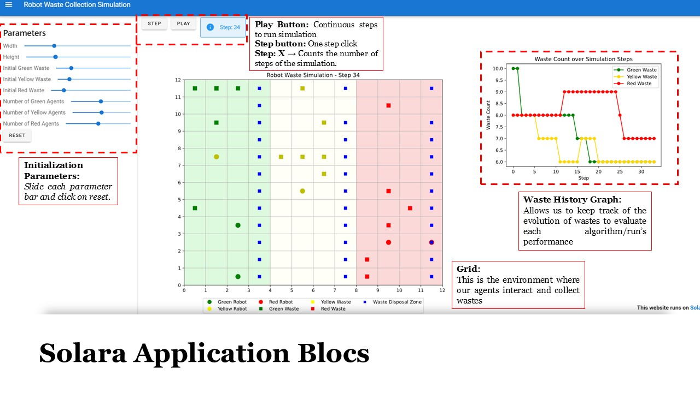

# SMA-cs-2025-robots
A repository to build the self-organization of robots in a hostile environment

  

# Our Approach

The ambition of this project being quite daunting, we decided to take the project step by step.
- Firstly, we interacted with the mesa and solara library to plot a single graph and wastes randomly, as well as the rules. At this point, the agent did not interact with each other. This was step 1.
- Step 2, we implemented agents that move randomly, collect wastes and transform them once they have gathered two of them. Red ones then put them on the disposal zone, getting rid of them altogether. 
- Step 3 consisted in implementing agents that can communicate with each other (for instance tell the nearest yellow agent that they transformed a yellow waste on their feet so that the yellow agent can collect it, etc...)
- Step 4 consisted in fine-tuning the heuristics and communication rules to leverage multi-agent strength (inspired by ants' pheromone as the teachers said) for the best performance possible.

## Our solution

We implemented four main blocs:
<strong>
- Initialization parameters
- Simulation buttons (play, step, count)
- Simulation environment grid
- Waste History Graph
</strong>

Each are detailed on the image and allow us to use the algorithm as per our liking (whether it be the size of the grid, the number of agents or more). 
For better UX, we limited the range of the initialization parameter for best performance, otherwise the run can become quite long as they would interact with each other. Even though the **inference time** was not one of our metric, we still hoped to offer best experience to the user through this limitation.

## Step descriptions & choices

## Criteria for success
Because our approach has a random component (stochastic nature of the agents movement), in all steps including the fine-tuned one, we decided that we would evaluate our algorithm using a custom feature: **the number of steps before 90% of the wastes are collected**. After all, finding the last waste could be done in a couple of steps, or, in the worst case, in hundreds.

  

## Results
| Step number | Description                                                                                                                                                   | Steps to reach 90% waste disposal                                                              | Image (line plot)              |
|-------------|---------------------------------------------------------------------------------------------------------------------------------------------------------------|------------------------------------------------------------------------------------------------|-------------------------------|
| 1           | Interacted with Mesa and Solara to plot a single graph and randomly generate wastes and rules. No agent interaction yet.                                     | Visualize basic setup and static waste distribution                                           |     |
| 2           | Implemented agents that move randomly, collect wastes, and transform them. Red agents dispose of waste in disposal zones.                                     | Enable collection and transformation logic                                                    |     |
| 3           | Enabled communication between agents—e.g., yellow agents are notified when others transform yellow waste nearby.                                              | Add basic inter-agent communication for coordinated action                                    |     |
| 4           | Fine-tuned heuristics and communication using multi-agent optimization strategies, inspired by pheromone trails (like ants).                                 | Refine logic to optimize teamwork and decision-making                                         |     |
| 5           | (Optional for now — summarize final model or results if needed later)                                                                                         | Final optimization toward stable >90% waste disposal                                          |     |

# Problem Overview and Constraints

## Problem Overview
The objective is to model and simulate a multi-agent system of robots that collect, transform, and transport hazardous waste in a hostile environment. The environment consists of different radioactive zones, and the robots must work within their capabilities to efficiently manage waste disposal. The mission involves:
- **Collecting** waste from designated areas.
- **Transforming** waste from one type to another.
- **Transporting** transformed waste to a secure disposal area.
- **Navigating** the environment while adhering to movement restrictions imposed by radioactivity levels.

## Environmental Constraints
The environment is divided into three distinct zones, each with increasing levels of radioactivity:
1. **Zone 1 (Low Radioactivity)**: Contains randomly placed green waste.
2. **Zone 2 (Medium Radioactivity)**: Intermediate area for waste transformation.
3. **Zone 3 (High Radioactivity)**: Final destination where transformed red waste must be stored.

Waste types:
- **Green Waste**: Initial waste collected from Zone 1.
- **Yellow Waste**: Transformed from green waste.
- **Red Waste**: Transformed from yellow waste and stored in Zone 3.

## Robot Constraints
Three types of robots operate under specific constraints:
### Green Robot:
- Moves within **Zone 1 only**.
- Collects 2 green wastes → Transforms into 1 yellow waste.
- Transports 1 yellow waste eastward.

### Yellow Robot:
- Moves within **Zones 1 and 2**.
- Collects 2 yellow wastes → Transforms into 1 red waste.
- Transports 1 red waste eastward.

### Red Robot:
- Moves within **Zones 1, 2, and 3**.
- Collects 1 red waste → Transports it to the waste disposal zone in Zone 3.

A rajouter: résultats, choix, etc... !